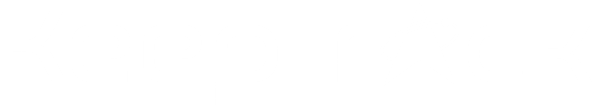

     



# KeepTrack.space™

> Professional satellite tracking for everyone

**KeepTrack™** brings real orbital mechanics to students and educators. Used by [EPFL’s Cosmos Archaeology](https://keeptrack.space/projects/cosmos-archeology),
[StarTalk](https://www.youtube.com/watch?v=H0jLiGAGtyg&t=130s), the [18th Space Defense Squadron](https://keeptrack.space/projects/operations-centers), and
[ethicallyHackingspace](https://start.ethicallyhacking.space/), among many others.

**Key Features:**

- 🚀 Track 50,000+ satellites in real-time
- ⚡ 5 MB core app, loads in under 2 seconds
- 🎮 Simulate 2.5M debris objects at 60fps
- 📱 Works on mobile, tablet, and desktop
- 🆓 Free, open source, runs offline

[Try it live](https://app.keeptrack.space) | [Installation](#installation) | [Screenshots](#screenshots)

---

# Table of Contents

- [Project Overview](#project-overview)
- [Who Is KeepTrack For?](#who-is-keeptrack-for)
- [Technology Stack](#technology-stack)
- [Installation](#installation)
- [Architecture](#architecture)
- [Contributing](#contributing)
- [Features](#features)
- [Screenshots](#screenshots)
- [Deployment](#deployment)
- [Release Notes](#release-notes)
- [Contributors](#contributors)
- [Trademarks](#trademarks)
- [License](#license)
- [Use of AI](#use-of-ai)
- [Additional Resources](#additional-resources)

---

# Project Overview

Welcome to KeepTrack, an ambitious project aiming to make orbital analysis tools accessible to all. KeepTrack provides a simplified and streamlined experience for learning and
interacting with satellites and space debris. Built from the ground up with custom WebGL 2.0 shaders, an internal orbital mechanics library, and a high-performance render loop,
this is a lot more than just dots around a globe.

**What makes KeepTrack unique:**

- Built with performance-first architecture
- No installation required—runs in any modern browser
- Offline capability for operations in restricted environments
- See satellites up close in 3D, or zoom all the way out to the entire solar system

---

## Who is KeepTrack For?

KeepTrack is used in operations centers, classrooms, and outreach programs around the world.

### Operations Centers

- Get popup alerts when satellites pass through sensor coverage
- Find when sensors can see priority satellites in seconds
- Simulate new launches for mission planning
- Model satellite breakups and debris fields

### Education

- Learn through hands-on interaction
- Use Xbox controllers for classroom demonstrations
- Experience AAA video game quality graphics
- Visualize complex orbital mechanics

### Outreach

- Embed KeepTrack on your website for free
- Show satellite designs in orbit before launch
- Explain space sustainability and the debris problem
- Create custom demos for public engagement

---

# Technology Stack

- **TypeScript** - Type-safe development with ES6+ modules
- **WebGL 2.0** - Hardware-accelerated 3D rendering
- **OOTK** ([ootk](https://github.com/thkruz/ootk)) - Orbital Mechanics library
- **Web Workers** - Background orbit calculations (non-blocking UI)
- **Webpack** - Module bundling and optimization
- **Materialize CSS** - UI framework (being modernized)

**Browser Requirements:** WebGL 2.0 support

- Chrome 56+ | Firefox 51+ | Safari 15+ | Edge 79+

---

# Installation

KeepTrack is automatically deployed to production and development environments:

- **Production:** <https://keeptrack.space>
- **Development:** <https://dev.keeptrack.space>

## Prerequisites

To build KeepTrack locally, you need:

- [Node.js](https://nodejs.org/) 18+ (`node --version` to check)
- [npm](https://www.npmjs.com/) or [pnpm](https://pnpm.io/)
- [git](https://git-scm.com/)

## Quick Start

```bash
# Clone the repository
git clone https://github.com/thkruz/keeptrack.space
cd keeptrack.space

# Install dependencies
npm install

# Build the project
npm run build

# Start development server
npm start
```

**Then open:** `http://localhost:5544` in your browser.

> **First time setup?** The app will download the satellite catalog (~5 MB) on first load. This takes approximately 30 seconds.

### Development Commands

| Command | Description |
|---------|-------------|
| `npm start` | Start dev server at `localhost:5544` |
| `npm run build` | Production build to `/dist` |
| `npm run lint` | Check code style |
| `npm run lint:fix` | Auto-fix linting issues |
| `npm test` | Run test suite |

### Troubleshooting

**Port 5544 already in use?**

The development server will automatically select an alternative port and display it in the terminal.

**Build errors?**

- Ensure Node.js 18+ is installed: `node --version`
- Clear npm cache: `npm cache clean --force`
- Delete `node_modules` and reinstall: `rm -rf node_modules && npm install`
- Still having problems? Open an issue and I will address it as soon as possible.

**Blank screen or WebGL errors?**

- Check browser console (F12) for error messages
- Verify WebGL 2.0 support: Visit <https://get.webgl.org/webgl2/>
- Update graphics drivers
- Try a different browser (Chromium based browser recommended for development)

**Catalog not loading?**

- Check network tab in browser DevTools
- Verify `api.keeptrack.space` is accessible

<!-- For detailed setup instructions, see: <https://keeptrack.space/resources/getting-keeptrack-running-locally/> -->
---

# Architecture

KeepTrack is transitioning from a monolithic structure to a clean, layered architecture that separates the rendering engine from application-specific features.

## Project Structure

```
src/
├── engine/                  # Core rendering engine (satellite-agnostic)
│   ├── core/                # Dependency injection, event bus
│   ├── plugins/             # Plugin system base classes
│   ├── rendering/           # WebGL pipeline, shaders
│   ├── input/               # Camera, mouse, keyboard controls
│   ├── ootk/                # Git Submodule of the OOTK Library
│   └── utils/               # Utilities and helpers
│
├── app/                     # Application layer (satellite-specific)
│   ├── data/                # Catalog management, TLE parsing
│   ├── sensors/             # Ground station calculations
│   ├── ui/                  # UI components and menus
│   └── utils/               # App-specific utilities
│
├── plugins/                 # Feature modules (optional functionality)
│   ├── sensor/              # Sensor management UI
│   ├── analysis/            # Orbit analysis tools
│   ├── screen-recorder/     # Recording functionality
│   └── ...                  # 50+ modular plugins
│
├── webworker/               # Background computation
│   ├── positionCruncher.ts  # Real-time position updates
│   └── orbitCruncher.ts     # Orbit line generation
│
└── settings/                # Configuration management
```

## Key Systems

### Rendering Pipeline (`engine/rendering/`)

- **WebGL 2.0 shaders** - Custom GLSL for points, lines, meshes
- **Draw manager** - 60fps render loop with up to 2.5M objects

### Camera Management (`engine/camera/`)

- **Camera system** - Multiple projection modes (perspective, orthographic, planetarium)

### Plugin System (`engine/plugins/`)

- **Modular architecture** - Features as isolated plugins
- **Dependency injection** - Automatic resolution of plugin dependencies
- **Hot-reloading** - Fast development iteration
- **UI integration** - Auto-generated bottom menu and side panels

### Catalog Manager (`app/data/`)

- **TLE parsing** - Two-Line Element set processing
- **Indexing** - Fast lookup by NORAD ID, COSPAR ID, name
- **Groups** - Predefined satellite collections (GPS, ISS, etc.)

### Web Workers (`webworker/`)

- **Non-blocking** - Orbit propagation runs in background threads
- **Message passing** - Syncs UI state with computation threads
- **Performance** - Offloads expensive calculations from main thread

## Design Principles

### Engine Layer

The engine should be **satellite-agnostic** and reusable for other space applications:

- ✅ Rendering, camera, input handling, scene management
- ✅ Plugin system, event bus, dependency injection
- ❌ TLE parsing, sensor calculations, satellite-specific UI

### Application Layer

The app layer contains **domain-specific logic**:

- ✅ Satellite catalog management
- ✅ Sensor field-of-view calculations
- ✅ Ground station tracking
- ✅ Launch simulation, breakup modeling
- ❌ Generic UI Utilities

### Plugin Layer

Plugins are **optional features** that can be enabled/disabled:

- Each plugin is self-contained
- Dependencies are explicitly declared
- Plugins can extend core functionality
- User can customize which plugins load
- Plugins should not be required for the core application to work

> **For contributors:** Keep engine code generic. Put satellite-specific logic in the app layer or plugins.

---

# Contributing

We welcome contributions! Whether you're fixing bugs, adding features, improving documentation, or creating new plugins, your help is appreciated.

## Development Workflow

1. **Fork** the repository to your GitHub account
2. **Clone** your fork: `git clone https://github.com/YOUR-USERNAME/keeptrack.space`
3. **Create a branch**: `git checkout -b feature/my-awesome-feature`
4. **Make changes** and test thoroughly
5. **Run linting**: `npm run lint` (auto-fix with `npm run lint:fix`)
6. **Commit**: Use clear, descriptive commit messages
7. **Push**: `git push origin feature/my-awesome-feature`
8. **Submit a PR** to the `develop` branch (not `main`)

> **NOTE:** Please avoid auto-formatting code outside of your requested changes. Format the line(s) you wish to edit, not the whole file.

## Code Standards

- **TypeScript strict mode** - All code must type-check without errors
- **ESLint compliant** - Run `npm run lint` before committing
- **No console.log** - Use the error manager for logging
- **Commented code** - Explain "why" not "what" for complex logic
- **Test your changes** - Use `npm run test` and refer to the [Regression Testing Documentation](docs/regression-testing.md)

## Adding Features

### Option 1: Create a Plugin (Recommended)

The easiest way to add features is via the plugin system. Plugins are:

- Self-contained and isolated
- Easy to enable/disable
- Use hooks to integrate into the rest of the application

**Example plugin structure:**

```typescript
import { KeepTrackPlugin } from '@app/engine/plugins/base-plugin';
import myIcon from './icon.png';

export class MyAwesomePlugin extends KeepTrackPlugin {
  readonly id = 'MyAwesomePlugin';
  dependencies_ = ['SomeOtherPlugin']; // Optional dependencies

  bottomIconImg = myIcon;
  bottomIconLabel = 'My Feature';

  addHtml() {
      // UI elements (optional)
  }

  addJs() {
    // Feature initialization
    EventBus.getInstance().on(EventBusEvent.KeyDown, (key: string, _code: string, isRepeat: boolean) => {
      if (key === 'A' && !isRepeat) {
        this.createAnAlert_();
      }
    });
  }

  private createAnAlert_() {
    // Your logic here
    alert('Hello World!!!');
  }
}
```

Place your plugin in `src/plugins/my-awesome-plugin/` and register it in [the plugin loader](src/plugins/plugins.ts).

<!-- For a detailed guide, see [Plugin Development Guide](./docs/PLUGIN-DEV.md). -->

### Option 2: Modify Core Systems

For changes to the engine, rendering pipeline, or core architecture:

1. **Open an issue first** - Discuss your approach before implementing
2. **Document your changes** - Update relevant documentation
3. **Consider backwards compatibility** - Don't break existing plugins
4. **Performance test** - Profile before and after your changes

## Pull Request Guidelines

**Good PRs include:**

- Clear description of what changed and why
- Reference to related issues (`Fixes #123`)
- Screenshots/GIFs for UI changes
- Updated documentation if needed
- Passing lint checks

**PR Review Process:**

1. Automated checks run (linting, build)
2. Maintainer reviews code
3. Feedback addressed
4. Merged to `develop` branch
5. Eventually promoted to `main` in the next release

## Areas We Need Help

- 🐛 **Bug fixes** - Check [open issues](https://github.com/thkruz/keeptrack.space/issues)
- 📚 **Documentation** - Improve guides, add examples
- 🌍 **Internationalization** - Add language translations
- ✨ **New plugins** - Analysis tools, visualizations, integrations
- 🧪 **Testing** - Increase test coverage

## Getting Help

- **Questions?** Open a [Discussion](https://github.com/thkruz/keeptrack.space/discussions)
- **Bugs?** File an [Issue](https://github.com/thkruz/keeptrack.space/issues)
- **Major changes?** Open an issue to discuss before implementing
- **Security issues?** Email <admin@keeptrack.space> privately

---

# Features

The feature set rivals those of expensive commercial toolkits, and includes:

## Core Capabilities

- **Real-time tracking** - 50,000+ satellites with live position updates
- **Sensor management** - Ground station pass predictions and field-of-view
- **Search and filtering** - Find satellites by name, NORAD ID, country, type
- **Orbit visualization** - 3D orbit lines with ground tracks
- **Time machine** - View satellite positions at any date/time
- **Multiple view modes** - Earth-centered, planetarium, astronomy

## Analysis Tools

- **Look angles** - Calculate azimuth, elevation, range to satellites
- **Access times** - Find when sensors can see specific satellites
- **Collision detection** - Identify close approaches
- **Launch simulation** - Model new satellite insertions
- **Breakup modeling** - Simulate satellite fragmentation events
- **Maneuver planning** - Create notional orbit adjustments

## Visualization

- **Custom color schemes** - Group satellites by type, country, velocity
- **Mesh models** - 3D models for ISS, cubesats, and more
- **Sun/Moon/Planets** - Accurate celestial body positions
- **Sensor coverage cones** - Visualize ground station field-of-view
- **Orbit history** - Trail mode showing satellite path over time

## Integration

- **Xbox controller** - Gamepad support for presentations
- **Embed mode** - [Integrate KeepTrack](#deployment) into your website
- **API access** - Programmatic control via JavaScript API
- **Screenshot/video** - Built-in screen recording
- **Custom catalogs** - Load your own TLE data

## And Much More

- Social media sharing
- Satellite timeline events
- Launch schedule integration
- Debris field analysis
- Line-of-sight calculations

---

# Screenshots

<p align="center">
  
  
</p>
<p align="center">
  
  
</p>
<p align="center">
  
  
</p>
<p align="center">
  
</p>

---

# Deployment

KeepTrack uses automated deployment via Cloudflare:

- **Production:** `main` branch (.env.app config) -> [keeptrack.space](https://app.keeptrack.space)
- **Development:** `develop` branch (.env.app config) -> [dev.keeptrack.space](https://dev.keeptrack.space)
- **Embed:** `main` branch with (.env.embed config) -> [embed.keeptrack.space](https://embed.keeptrack.space)

<!-- For self-hosting instructions, see [Deployment Guide](./docs/DEPLOYMENT.md). -->

---

# Release Notes

## Recent Versions

- Version 11.0 - [Copernicus](./docs/v11.md) - **Current**
- Version 10.0 - [Euclid](./docs/v10.md)
- Version 9.1 - [Kepler](./docs/v9.1.md)
- Version 9.0 - [Kepler](./docs/v9.md)

## Previous Versions

- Version 8.2 - [Phoenix](./docs/v8.2.md)
- Version 8.1 - [Phoenix](./docs/v8.1.md)
- Version 8.0 - [Phoenix](./docs/v8.md)
- Version 7.2 - [Nebula Navigator](./docs/v7.2.md)
- Version 7.0 - [Vega Viewpoint](./docs/v7.md)
- Version 6.0 - [Celestial Symphony](./docs/v6.md)
- Version 5.4 - [Orion Overhaul](./docs/v5.4.md)
- Version 5.0 - [Apollo Augments](./docs/v5.md)

---

# Contributors

Special thanks to all contributors who have helped make KeepTrack better:

- [@hkruczek](https://github.com/hkruczek/) - Features and testing
- [@Le-Roi777](https://github.com/Le-Roi777/) - UI/UX design and implementation
- [@norbertpouzin](https://github.com/norbertpouzin/) - Plugin development
- [@Koroviev-and-Begemot](https://github.com/Koroviev-and-Begemot/) - Plugin development
- [@RylandAdams](https://github.com/RylandAdams/) - Plugin development
- [@cwang-pivotal](https://github.com/cwang-pivotal/) - Bug fixes and improvements

**Want to be listed?** Submit a PR and add yourself!

## Original Work

KeepTrack is based on the original [Things in Space](https://github.com/jeyoder/ThingsInSpace/) by [James Yoder](https://github.com/jeyoder/), released under the MIT License. While
the codebase has been completely 100% rewritten with new architecture, we acknowledge and appreciate the foundational concept.

## Featured Users

KeepTrack is proud to have been used by:

- **Combined Space Operations Center** - U.S. Space Force operations
- **Cosmos Archaeology** - University of Lausanne exhibitions in Switzerland and China
- **StarTalk Podcast** - Neil DeGrasse Tyson's podcast
- **BBC News Coverage** - BBC's coverage of the 74th Intelligence, Surveillance and Reconnaissance Squadron
- **Espace Ballon** - "Altitudes" exhibit with the short film "Human Debris in Space 1957-2024"
- **Space Waste Lab** - Studio Roosegaarde art installation

*Using KeepTrack in your project?* [Let us know!](mailto:admin@keeptrack.space)

---

# Trademarks

KeepTrack™ and KeepTrack.space™ are trademarks of Kruczek Labs LLC.

- ✅ You may use "KeepTrack" to refer to this software
- ✅ You may say "powered by KeepTrack" or "based on KeepTrack"
- ❌ You may not use "KeepTrack" in your product name or domain
- ❌ You may not imply endorsement without permission

---

# License

Copyright (C) 2025 Kruczek Labs LLC

KeepTrack is licensed under the **GNU Affero General Public License v3.0 or later**.

This means you can:

- ✅ Use KeepTrack for any purpose
- ✅ Modify the source code
- ✅ Distribute copies
- ✅ Distribute modified versions

**Under these conditions:**

- 📝 Disclose source code of modified versions
- 📝 License derivative works under AGPL-3.0
- 📝 Include copyright and license notices
- 📝 State significant changes made to the code
- ⚠️ **Network use counts as distribution** (AGPL-specific)

**And you can't:**

- ❌ Sublicense under different terms
- ❌ Hold authors liable for damages
- ❌ Use without providing attribution
- ❌ **Run a modified version as a service without sharing ALL source code**

## Example Use Cases

### ✅ Example 1: Educational Institution

You fork KeepTrack, add custom plugins for your astronomy course, and host it on your university's public website for students.

Allowed - You must make your modified source code available (e.g., via GitHub) and clearly state what you changed. Include AGPL license and credit original authors.

### ❌ Example 2: Commercial SaaS Platform

You modify KeepTrack, rebrand it as "SatTracker Pro," and offer it as a paid subscription service without sharing your source code.

Not allowed - Running modified AGPL software as a network service counts as distribution. You must provide source code to all users, even paying customers. The AGPL specifically
prevents this "SaaS loophole." If this license obligation is violated, Kruczek Labs LLC may take legal action to enforce its intellectual property rights.

### ✅ Example 3: Open Source Contribution

You add a new debris collision analysis plugin, publish it on GitHub under AGPL-3.0, and submit a pull request to the main repository.

Allowed and encouraged! - Your plugin is properly licensed, source is available, and you've contributed back to the community. This is exactly what the AGPL is designed to enable.

For more details, see the [Full License](https://github.com/thkruz/keeptrack.space/blob/master/LICENSE) or visit <https://www.gnu.org/licenses/agpl-3.0.html>.

## Why AGPL?

The AGPL ensures that improvements to KeepTrack remain open source, even when used as a web service. If you run a modified version, you must make your source code available to users.

**Need a different license?** [Contact Kruczek Labs](mailto:admin@keeptrack.space) about commercial licensing options.

---

# Use of AI

KeepTrack uses AI-assisted development tools to maintain a large codebase with an international audience:

- GitHub Copilot - Code acceleration and refactoring
- Claude AI - Shader debugging and architecture troubleshooting
- Stable Diffusion - Splash screen generation
- OpenAI - Translations for 7 languages

Why? Managing 50,000+ lines of code, 50+ plugins, and 7 languages as a solo developer is unsustainable without assistance. These tools enable faster releases, better
internationalization, and more features while maintaining quality.

Could KeepTrack exist without AI? Yes - it did for years. But as the project grew to serve commercial, military, and educational institutions worldwide, AI became the most cost-effective way to
maintain quality at scale.

For contributors: You are NOT required to use AI tools. Whether you code with Vim or Copilot, contributions are equally valued. We care about code quality, not your workflow.

Disagree with this approach? You're free to fork and maintain your version of KeepTrack however you prefer. We respect all development philosophies.

---

# Additional Resources

- **Live Demo:** <https://app.keeptrack.space>
- **Documentation:** <https://docs.keeptrack.space>
- **API Documentation:** <https://api.keeptrack.space/v3/docs>
- **OOTK Library:** <https://github.com/thkruz/ootk>

---

<p align="center">
  Made with ❤️ by <a href="https://github.com/thkruz">Theodore Kruczek</a> and <a href="#contributors">contributors</a>
</p>

<p align="center">
  <a href="https://keeptrack.space">Website</a> •
  <a href="https://github.com/thkruz/keeptrack.space/issues">Issues</a> •
  <a href="https://github.com/thkruz/keeptrack.space/discussions">Discussions</a> •
  <a href="mailto:theodore.kruczek@gmail.com">Contact</a>
</p>
