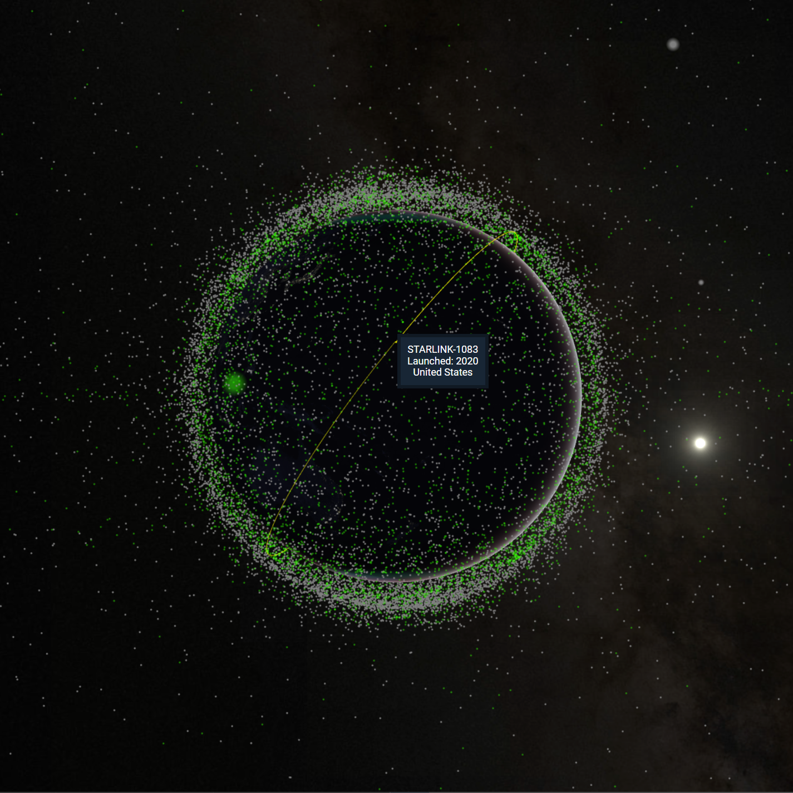
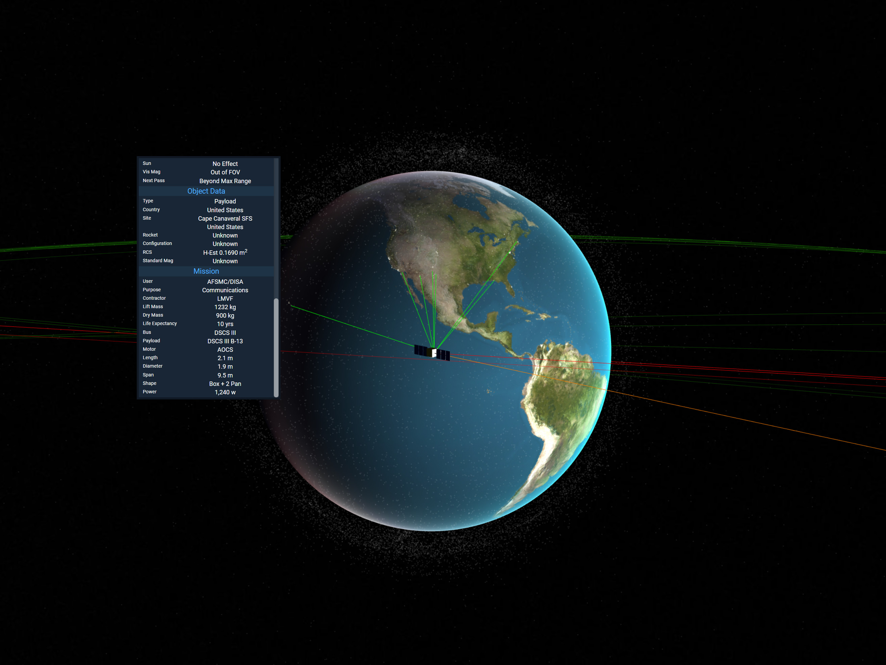
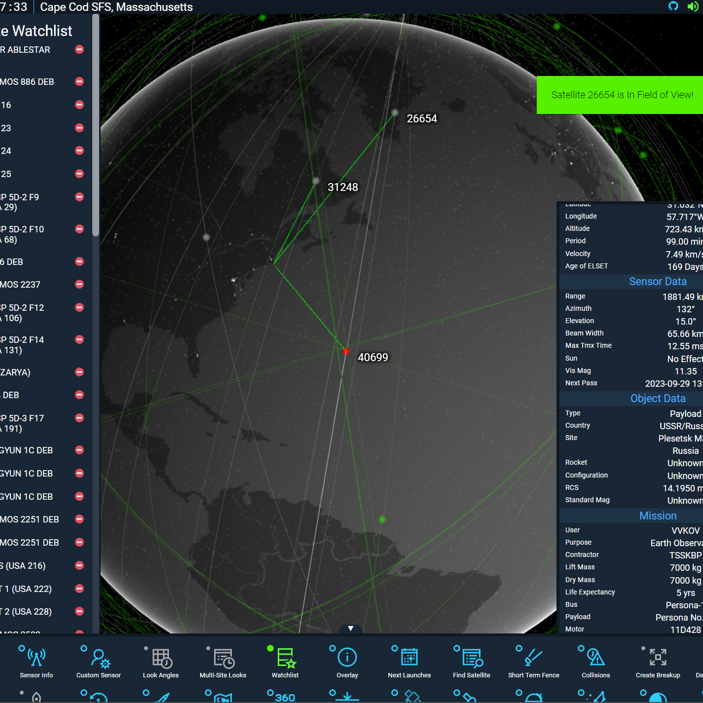
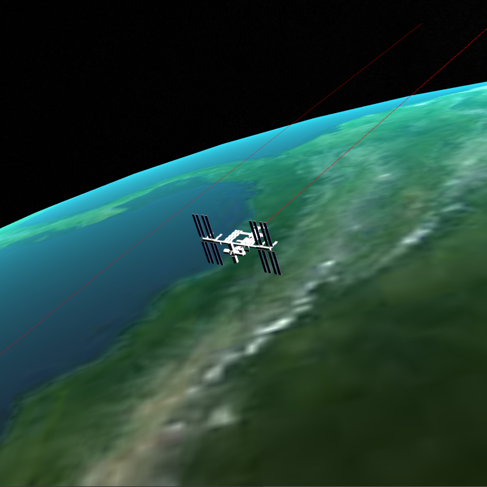

      [](https://github.com/prettier/prettier)   

# Table of Contents

- [Project Overview](#project-overview)
- [Who Should Use KeepTrack?](#who-should-use-keeptrack)
- [Features](#features)
- [Screenshots](#screenshots)
- [Installation](#installation)
- [Usage](#usage)
- [Code Structure](#code-structure)
- [Previous Versions](#previous-versions)
- [Contributors](#contributors)
- [License](#license)

# Project Overview

Welcome to KeepTrack, an ambitious project aiming to make orbital analysis tools accessible to all. We believe in the power of democratizing information and fostering knowledge about orbital mechanics and satellite operations. Our software is sophisticated enough to provide a tactical common picture on a military operations floor yet intuitive enough for a high schooler to explore and learn about orbits on a tablet.

## Who Should Use KeepTrack?

KeepTrack is designed for anyone interested in satellites, space operations, and radars. Our software is built to be a comprehensive yet easy-to-use toolkit for experts in the field, as well as an engaging and informative platform for novices eager to learn more about the fascinating world of space operations.

## Features

Our feature set rivals those of expensive toolkits, such as AGI's STK, and includes the ability to:

- View comprehensive satellite data
- Perform advanced field of view calculations
- Create notional maneuvers
- Model satellite breakups
- Simulate new satellite launches
- And many more

# Screenshots

<!-- white border -->
<div style="border: 1px solid white;">
    
</div>
<div style="border: 1px solid white;">
    
</div>
<div style="border: 1px solid white;">
    
</div>
<div style="border: 1px solid white;">
    
</div>

# Installation

Starting with Version 3, a github page is automatically deployed with the most-current version of the main branch to https://thkruz.github.io/keeptrack.space/. Periodically the most stable version will be pushed to https://keeptrack.space from the CI/CD pipeline.

## Prerequisites

KeepTrack.Space is built using ES6+ modules and assembled with Webpack. If you would like to build it locally, you need to install [git](https://git-scm.com/) and [npm](https://www.npmjs.com/).

## Setting up a Local Copy

```bash
git clone https://github.com/thkruz/keeptrack.space       #Clone the github files.
cd ./keeptrack.space/                                     #Switch into the directory.
npm ci                                                    #Install the dependencies.
npm run build                                             #Build the project.
npm start                                                 #Start the server.
```

## Launching Offline Mode

KeepTrack was designed to run without the need for a server. On Windows, close all open copies of chrome and then launch the included KeepTrack.bat file. This will launch the index.html file inside of chrome with the "--allow-file-access-from-files" flag temporarily enabled. This is necessary to allow loading the catalog .json files from your computer.

NOTE: You MUST compile the code first. Opening the index.html file in the src folder will not work. If that feels overwhelming, take a look at https://github.com/thkruz/keeptrack.space/tree/gh-pages for a built version that can be downloaded and launched without the need to build it.

# Usage

The main index.html page loads a canvas element set to the size of the window that displays the earth, satellites, and stars. The UI is loaded in DOM elements on top of the canvas element. Two webworkers are loaded (positionCruncher.ts and orbitCruncher.ts) to handle constant calculation of satellite locations and updating orbit lines when an object is highlighted.

The main draw loop (drawManager.ts) has been optimized to reduce memory leaks and to keep FPS high. This is commonly done by having functions modify global variables vs returning a variable and using long functions rather than splitting them into pieces - this is definitely intentional.

Any modifications to a satellite require that information to be passed to the positionCruncher webworker to ensure the UI calculations match the dot on the screen. Most calculations utilize a brute-force method of guess and check (lookangle times, missile trajectories, etc). Optimizing the loop for those calculations is critcal to keeping the project responsive. One trick to improve performance is that satSet creates a dictionary of index -> Norad ID number and index -> COSPAR number to allow rapid lookup of satellite data.

There are Typescript files for generating TLE.json that are not included, but http://keeptrack.space/tle/TLE2.json can be referenced for an up-to-date catalog.

# Previous Versions

- Version 7.2 - [Nebula Navigator](./docs/v7.2.md)
- Version 7.0 - [Vega Viewpoint](./docs/v7.md)
- Version 6.0 - [Celestial Symphony](./docs/v6.md)
- Version 5.4 - [Orion Overhaul](./docs/v5.4.md)
- Version 5.0 - [Apollo Augments](./docs/v5.md)

# Contributors

- [@Le-Roi777](https://github.com/Le-Roi777/)
- [@hkruczek](https://github.com/hkruczek/)
- [@cwang-pivotal](https://github.com/cwang-pivotal/)

# License

Copyright (C) 2016-2023 Theodore Kruczek<br> Copyright (C) 2020-2023 Heather Kruczek

KeepTrack.Space is licensed under the GNU Affero General Public License. This means you can freely use, modify, and distribute it, provided you adhere to the terms of the license. For more details, see the [Full License](https://github.com/thkruz/keeptrack.space/blob/master/LICENSE).
