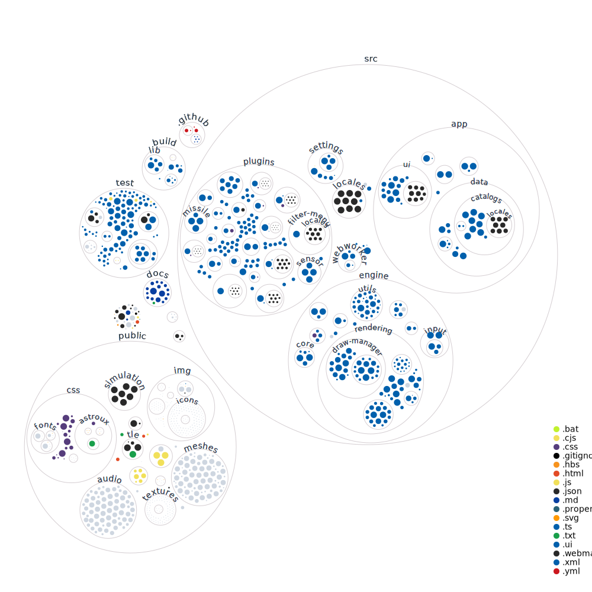

# Technical Documentation

# Table of Contents

- [Built With](#Built-With)
- [Main Files](#main-files)
- [Visualization of Codebase](#visualization-of-codebase)
- [Main Files](#main-files)
- [Libraries](#libraries)
- [Artificial Intelligence](#artificial-intelligence)
- [Tests](#Tests)
- [Versioning](#versioning)

# Built With

[](https://code.visualstudio.com/)[](https://git-scm.com/)[](https://www.npmjs.com/)[](https://developer.mozilla.org/en-US/docs/Web/WebGL)[](https://babeljs.io/)[](https://webpack.js.org/)[](https://eslint.org/)[](https://jestjs.io/)[](https://www.cypress.io/)[](http://github.com)[](https://gitlab.com)

# Visualization of Codebase

[](https://mango-dune-07a8b7110.1.azurestaticapps.net/?repo=thkruz/keeptrack.space)

# Main Files

- index.html - Controls the structure of the front-end and loads all the CSS and JS files.
- index.ts - Primary TS file that bootstraps all of the other files.
- camera.ts - cameraManager is used to create cameraManager that serves as the interface from the UI and the webgl camera.
- colorSchemeManager.ts - Handles the creation of color schemes for the dots.
  - colorManager/ruleSets - These files handle the ruleset for how to color dots when enabled.
- drawManager.ts - Controls the main draw loop.
  - sceneManager.ts - Manages the sun, earth, moon, lines and atmosphere drawing.
  - meshManager.ts - Controls the loading and drawing of .obj models of satellites.
  - post-processing.js - Loads and draws post processing shaders like gausian blur. Not used at the moment.
- groupsManager.ts - Manages creation and loading of satellite groups
  - sat-group.ts - Manages individual satellite group
- missileManager.ts - ICBM/SLBM simulator.
- objectManager.ts - Used for extracting details from TLE.json and loading additional objects from other files.
  - controlSiteManager.ts - Database of command and control locations.
  - launchSiteManager.ts - Database of launch locations.
- orbitManager.ts - Draws the orbit lines. Called from the main draw loop.
- photoManager.ts - Handles the loading and displaying of satellite photography from external sources.
- satSet.ts - Most of the manipulation of the local satellite catalogue occurs here.
- sensorManager.ts - Database of sensor locations.
- starManager.ts - Database of stars.
  - constellations.ts - Add-on database of star constellations.
- timeManager.ts - Tracks internal time and controls time manipulation.
- uiManager.ts - Controls user keyboard/mouse inputs to the application.
  - mapManager.ts - Modified version of [@juliuste](https://github.com/juliuste/projections)'s library for stereographic map projection.
  - searchBox.ts - Functions for searching the catalog and manipulating the search drop-down.
- orbitCruncher.ts - Web Worker that generates future orbits for satellites.
- positionCruncher.ts - Web Worker that provides x, y, z coordinates of the satellites and if it is in a sensor's FOV.
- TLE2.json - The main database on satellites. (Second edition)

# Libraries

- [ootk](https://github.com/thkruz/ootk) - [@thkruz](https://github.com/thkruz)'s TypeScript library for working with SGP4, sensor field of view, and Astronomical calculations.
  - Credit to [@shashwata](https://github.com/shashwatak/)'s amazing library satellite.js and [@mourner](https://github.com/mourner/suncalc)'s library suncalc for laying the ground work.

## Note on Performance

Performance optimization is a top priority for KeepTrack. We have made conscious decisions to avoid large libraries like three.js to fine-tune performance. As a result, KeepTrack is capable of modeling more than 2.5 million satellites in real-time using SGP4. This focus on optimization is part of our commitment to providing a powerful and efficient tool for users to explore and understand space operations.

# Artificial Intelligence

Artificial intelligence plays a vital role in enhancing the development process and creating an engaging user experience in KeepTrack.Space. From boosting the efficiency of writing code and tests, assisting in documentation, to generating stunning graphics, several AI tools and models are actively being used.

## GitHub Copilot

[GitHub Copilot](https://copilot.github.com/) is an AI-powered coding assistant that helps in writing new lines of code and understanding the codebase. It provides relevant suggestions for building new features or debugging the existing code. In the development of KeepTrack.Space, GitHub Copilot has been instrumental in expediting the development process and enhancing the code quality.

## Codium AI

[Codium AI](https://codium.ai/) is a robust tool that leverages artificial intelligence for generating unit tests and documentation. It assists in improving the code quality and ensures that all components of the software are well-tested and documented. It has been a great asset in maintaining the reliability of KeepTrack.Space and making the project's intricacies easily understandable for new contributors.

## Stable Diffusion

To enhance the aesthetics of the loading screen, KeepTrack.Space uses [Stable Diffusion](https://www.midjourney.com/home/), an AI model used for creating images. Stable Diffusion helps in generating unique and captivating images that add to the overall user experience, making the loading screen visually appealing while the necessary data for the application is being loaded in the background.

## ChatGPT-4

The latest language model developed by OpenAI, [ChatGPT-4](https://openai.com/research/chatgpt), has been utilized for assisting in the documentation process and preparing this README file. By generating coherent and contextually relevant text, ChatGPT-4 streamlines the documentation process, ensuring that all aspects of the project are effectively communicated.

# Tests

## Unit/Functional

Currently we are using Jest for unit and functional tests that should cover at least 80% of the functions. All of these tests can be run using:

```bash
npm run test
```

## End-To-End

For end-to-end (E2E) testing we will be using the cypress framework. This is on the to-do list.

## Fuzz

For fuzz testing the user interface we use [gremlins.js](https://github.com/marmelab/gremlins.js/). You can unleash the gremlins using db.gremlins() in your web browser's console. By default it runs for 1000 interactions or 10 errors. You will need to ensure the debug plugin is enabled (see settingsManager.js).

## Security

For security testing we are using CodeQL and SonarCloud automatically in the CI/CD pipeline.

# Versioning

We use [SemVer](http://semver.org/) for versioning.

# Style Guide

We use Prettier and ESLint to enforce consistent readable code. Please refer to our [best practices](./contributing.md#best-practices) for more info on styling.

# Contributing

If you are interested in helping with this project, please reference the [Contributing Guidelines](./contributing.md).
